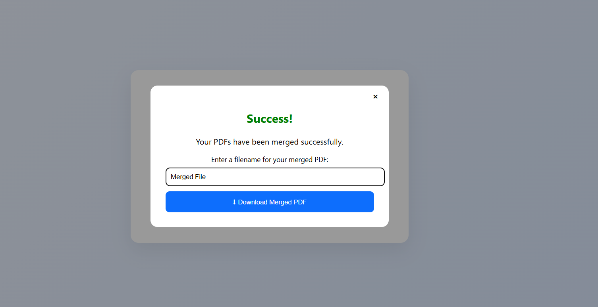

# 📄 PDF Merger Web Application

A simple web application built using **Django** that allows users to upload multiple PDF files and merge them into a single PDF document.

This project demonstrates basic **full-stack web development** with Python, Django, and PDF file handling.

---

## 🚀 Features

- Upload multiple PDF files
- Merge PDFs into a single document
- Remove selected files before merging
- Download the merged PDF
- Simple and user-friendly interface

---

## 🛠️ Technologies Used

- **Backend:** Python, Django  
- **Frontend:** HTML, CSS, JavaScript  
- **PDF Library:** pypdf  
- **Version Control:** Git, GitHub  

---

## 📂 Project Structure

```
pdf_merger_project
│
├── manage.py
├── pdf_merger
│
├── merger
│   ├── views.py
│   ├── urls.py
│   └── models.py
│
├── templates
│   └── index.html
│
├── static
│   ├── style.css
│   └── script.js
│
└── images
    ├── home.png
    └── success.png
```

---

## 🖼️ Screenshots

### Home Page


### Merge Success Page



---

## ⚙️ Installation

### Clone the repository

```bash
git clone https://github.com/DHANYASREE-KG/PDF_MERGER.git
```

### Navigate to the project directory

```bash
cd PDF_MERGER
```

### Create a virtual environment

```bash
python -m venv venv
```

### Activate the virtual environment (Windows)

```bash
venv\Scripts\activate
```

### Install dependencies

```bash
pip install django pypdf
```

### Run the development server

```bash
python manage.py runserver
```

### Open in browser

```
http://127.0.0.1:8000/
```

---

## 📌 Future Improvements

- Drag and drop file upload
- Reorder PDF files before merging
- Add PDF split functionality
- Deploy the application online

---

## 👩‍💻 Author

**Dhanya Sree K G**

- GitHub: https://github.com/DHANYASREE-KG
- LinkedIn: https://linkedin.com/in/dhanya-sree-k-g
